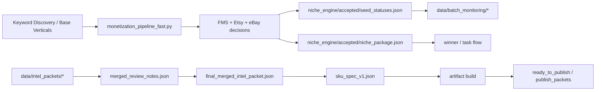

# ARCHITECTURE

## System shape

Autofinisher Factory is now a layered, file-driven system with two connected loops:

1. **market validation loop**
2. **product packaging loop**

The repository is organized around explicit JSON artifacts. Runtime truth is generally taken from batch outputs first, and product-packaging truth is taken from merged intel packets second.

## High-level execution flow

### Market validation loop

1. `run_monetization_batch_fast.py` starts a batch.
2. `monetization_pipeline_fast.py` orchestrates Google, Etsy, and eBay signal collection.
3. Optional keyword-derived seeds are imported through keyword discovery.
4. `fms_engine.py` computes canonical FMS.
5. `monetization_pipeline_fast.py` writes per-seed decision outputs.
6. Accepted results are propagated into winner / task flow when applicable.
7. `batch_reference_monitor.py` computes batch KPI, history, and alerts.
8. `publish_packets/summary.json` is enriched with compact monitoring metadata.

### Product packaging loop

1. product cluster variants are archived under `data/intel_packets/`
2. variant comparison produces `merged_review_notes.json`
3. merged packet produces `final_merged_intel_packet.json`
4. merged packet produces `sku_spec_v1.json`
5. build step produces `ready_to_publish/<slug>/...`
6. publish step and live metrics become the next validation layer

## Current execution graph

## Current important runtime features

### 1. Keyword discovery as seed import

Keyword discovery is now wired into the repo through:

- `keyword_engine/keyword_compiler.py`
- `keyword_engine/keyword_to_niche_candidates.py`
- `mcp/keyword_discovery_mcp.py`
- `scripts/etsy_keyword_scraper_playwright.py`
- `scripts/google_keyword_scraper_playwright.py`
- `config/keyword_discovery.yaml`

It acts as **seed import**, not as a scoring override.

Current shape:

`Keyword Discovery -> Seed Import -> Standard FMS / Etsy / eBay Pipeline`

### 2. Keyword-only mode exists in the fast pipeline

`monetization_pipeline_fast.py` now supports:

- base-only mode
- base + keyword import mode
- keyword-only mode via `KEYWORD_DISCOVERY_ONLY=1`

It also supports a hard filter for keyword-derived seed length via `MAX_KEYWORD_DISCOVERY_SEED_WORDS`.

### 3. Product packaging state is in-repo

The current reseller cluster packaging work lives under:

- `data/intel_packets/reseller_finance_inventory_system/`

This directory now contains:

- variant archives
- merge notes
- final merged packet
- `sku_spec_v1.json`

## Artifact graph

### Validation artifacts

- `niche_engine/accepted/seed_statuses.json`
- `niche_engine/accepted/niche_package.json`
- `data/validated_niches/items/*.json`

### Keyword-discovery artifacts

- `data/keyword_runs/<run_id>/summary.json`
- `data/keyword_runs/<run_id>/money_shortlist.csv`
- `niche_engine/candidates/keyword_discovery_index.json`

### Product-intel artifacts

- `data/intel_packets/reseller_finance_inventory_system/manifest.json`
- `data/intel_packets/reseller_finance_inventory_system/merged_review_notes.json`
- `data/intel_packets/reseller_finance_inventory_system/final_merged_intel_packet.json`
- `data/intel_packets/reseller_finance_inventory_system/sku_spec_v1.json`

### Monitoring artifacts

- `data/batch_monitoring/reference_batch_summary.json`
- `data/batch_monitoring/reference_alerts.json`
- `data/batch_monitoring/batch_kpi_history.json`

### Publishing artifacts

- `ready_to_publish/*`
- `publish_packets/*`
- `publish_packets/summary.json`

## Layer boundaries

### Discovery layer

Responsibilities:

- Google candidate discovery
- Etsy shortlist generation
- eBay liquidity validation
- keyword shortlist compilation
- keyword-derived seed import

Primary files:

- `google_niche_scraper.py`
- `etsy_mcp_scraper.py`
- `niche_profit_engine.py`
- `keyword_engine/*.py`
- `mcp/keyword_discovery_mcp.py`

### FMS / decision layer

Responsibilities:

- compute canonical `fms_score`
- compute `fms_components`
- keep keyword discovery separate from canonical FMS scoring
- assign candidate / reject / accept reason codes

Primary files:

- `fms_engine.py`
- `fms_reference.py`
- `fms_decision.py`
- `monetization_pipeline_fast.py`

### Validation artifact layer

Responsibilities:

- write batch truth for each seed
- preserve status, `reason_code`, `reason_detail`, FMS, Etsy/eBay diagnostics
- propagate accepted outputs downstream

Primary files:

- `monetization_pipeline_fast.py`
- `winner_duplicator.py`
- `niche_engine/contracts/*.json`

### Monitoring layer

Responsibilities:

- compute batch yield KPI
- compare batch quality to reference winner
- maintain rolling history
- emit alert JSON for dashboards and downstream agents

Primary files:

- `batch_reference_monitor.py`
- `SPEC_monitoring.md`
- `data/batch_monitoring/*`

### Product-intel / merge layer

Responsibilities:

- archive intel packet variants
- compare variants
- merge safe fields into one final packet
- keep externally asserted market details separate from batch-verified facts

Primary location:

- `data/intel_packets/reseller_finance_inventory_system/*`

### SKU build layer

Responsibilities:

- convert accepted niche outputs or synthetic bridge inputs into publishable artifacts
- generate deliverables and listing assets under `ready_to_publish/`

Primary files:

- `premium_sku_factory.py`
- `artifact_builder.py`

## Design rules

- FMS decisions use canonical `fms_score` from `fms_engine.py`.
- keyword discovery may supply seeds, but must not directly override FMS.
- `reference_ratios` are diagnostic, not gating.
- monitoring is post-batch and does not change validation results.
- publish summary contains compact monitoring metadata and links.
- merged product packets should mark external Etsy/YouTube specifics as hypotheses until manually rechecked.
- current reseller SKU direction is **experimental build first, live metrics second**.
