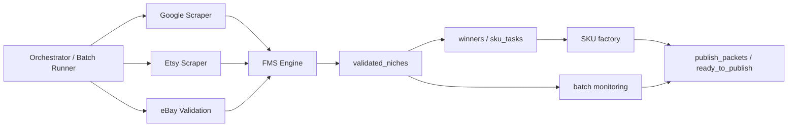

# Autofinisher Factory

Autofinisher Factory is a batch-oriented niche discovery and digital SKU production system.

Its core job is to find monetizable digital-product niches, validate them through Etsy/eBay/FMS signals, fix validated outputs into machine-readable artifacts, and push approved winners into SKU production and publishing preparation.

## Core entities

- **FMS** — canonical scoring layer for niche quality.
- **validated_niches** — per-niche validation snapshots with status, reason, Etsy/eBay metrics, reference ratios, and file links.
- **reference_ratios** — relative comparison to the current reference winner (`adhd cleaning checklist`).
- **alerts** — post-batch yield + reference monitoring outputs.
- **dashboards** — downstream consumers of monitoring and batch summary artifacts.

## High-level architecture

## Start here for agents

Recommended reading order:

1. `README.md`
2. `ARCHITECTURE.md`
3. `AGENTS.md`
4. `SPEC_fms.md`
5. `SPEC_yield_alerts.md`
6. `SPEC_dashboards.md`
7. `niche_engine/contracts/*.json`

## Key directories

- `monetization_pipeline_fast.py` — fast niche validation pipeline
- `fms_engine.py` — canonical FMS computation
- `winner_duplicator.py` — validated_niches and winner-flow
- `batch_reference_monitor.py` — post-batch yield + reference monitoring
- `niche_engine/accepted/` — batch outputs
- `data/validated_niches/` — per-niche validation snapshots
- `data/winners/` — winner cards
- `data/sku_tasks/` — SKU factory tasks
- `data/batch_monitoring/` — batch KPI history and alerts
- `publish_packets/summary.json` — main publish summary with compact monitoring block

## Entry points

- Run fast batch: `python3 run_monetization_batch_fast.py`
- Run monitoring only on current batch: `python3 batch_reference_monitor.py`
- Refresh local memory: `python3 memory_agent/refresh_memory.py`

## Current source of truth

For scoring and validation:

- canonical score: `fms_engine.py`
- per-niche truth: `data/validated_niches/items/*.json`
- batch-level truth: `data/batch_monitoring/reference_batch_summary.json`
- batch alerts: `data/batch_monitoring/reference_alerts.json`
