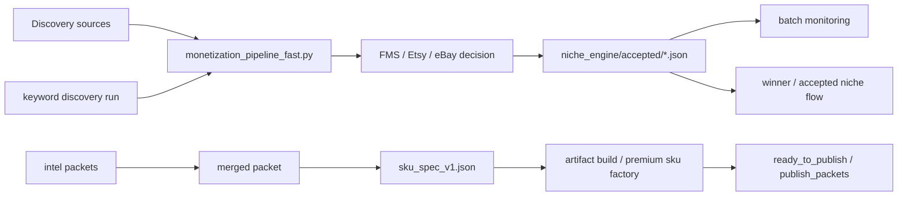

# Autofinisher Factory

Autofinisher Factory is a batch-oriented niche discovery, validation, and digital SKU production system.

The repository currently supports two connected operating loops:

1. **market validation loop** — discovery → FMS / Etsy / eBay validation → candidate / reject / winner outputs
2. **product packaging loop** — cluster intel → merged packet → SKU spec → build artifacts → publish prep

The project is file-driven: most important state is written to JSON artifacts inside the repository.

## Current operational model

## What is new in the current repo state

### 1. Keyword discovery is now a first-class seed source

Current keyword-discovery components:

- `keyword_engine/keyword_compiler.py`
- `keyword_engine/keyword_to_niche_candidates.py`
- `mcp/keyword_discovery_mcp.py`
- `scripts/etsy_keyword_scraper_playwright.py`
- `scripts/google_keyword_scraper_playwright.py`
- `config/keyword_discovery.yaml`

Keyword discovery is **seed import**, not a separate scoring override.
The system shape is:

`Keyword Discovery -> Seed Import -> Standard FMS / Etsy / eBay Pipeline`

### 2. `monetization_pipeline_fast.py` now supports keyword-only execution

Important env flags:

- `KEYWORD_DISCOVERY_IMPORT_ENABLED=1`
- `KEYWORD_DISCOVERY_ONLY=1`
- `KEYWORD_DISCOVERY_RUN_ID=<run_id>`
- `KEYWORD_DISCOVERY_MAX_CANDIDATES=<n>`
- `MAX_KEYWORD_DISCOVERY_SEED_WORDS=6`

This gives three modes:

- default: base verticals only
- import mode: base + keyword-derived verticals
- keyword-only mode: keyword-derived verticals only

### 3. Product-intel artifacts now exist in-repo

Cluster-intel and merge artifacts for the reseller finance / inventory line now live under:

- `data/intel_packets/reseller_finance_inventory_system/manifest.json`
- `data/intel_packets/reseller_finance_inventory_system/intel_packet_variant_1_user_filled_v1.json`
- `data/intel_packets/reseller_finance_inventory_system/intel_packet_variant_2_assistant_conservative_v2.json`
- `data/intel_packets/reseller_finance_inventory_system/intel_packet_variant_3_user_ready_for_build_v3.json`
- `data/intel_packets/reseller_finance_inventory_system/merged_review_notes.json`
- `data/intel_packets/reseller_finance_inventory_system/final_merged_intel_packet.json`
- `data/intel_packets/reseller_finance_inventory_system/sku_spec_v1.json`

### 4. Current build direction is cluster-first, not keyword-width-first

The current working product hypothesis is:

- **Reseller Finance & Inventory System**

The agreed direction is:

- Google Sheets first
- one fat reseller operating system
- publish experimental SKU first
- validate next through live listing metrics rather than widening keyword sweeps

## Fast navigation for agents

Recommended reading order for a fresh agent:

1. `README.md`
2. `AGENTS.md`
3. `ARCHITECTURE.md`
4. `docs/PROJECT_NAVIGATION.md`
5. `data/intel_packets/reseller_finance_inventory_system/manifest.json`
6. `data/intel_packets/reseller_finance_inventory_system/final_merged_intel_packet.json`
7. `data/intel_packets/reseller_finance_inventory_system/sku_spec_v1.json`
8. `monetization_pipeline_fast.py`
9. `run_monetization_batch_fast.py`
10. `niche_engine/accepted/seed_statuses.json`
11. `publish_packets/summary.json`

## Core entities

- **FMS** — canonical market-quality scoring layer
- **seed_statuses** — per-seed decision output with `reason_code`, `reason_detail`, FMS, Etsy/eBay diagnostics
- **niche_package** — accepted/winner-facing batch package
- **keyword_runs** — discovery-run artifacts (`summary.json`, `money_shortlist.csv`)
- **intel packets** — cluster-level market + workflow packaging research
- **sku_spec** — build-ready product contract for one SKU
- **publish summary** — current build / publish packet summary

## Primary entry points

### Batch validation

- `python3 run_monetization_batch_fast.py`
- `python3 batch_reference_monitor.py`

### Keyword discovery

- `python3 mcp/keyword_discovery_mcp.py --run-id <id> --run-etsy --run-google --seeds "..."`
- `python3 mcp/keyword_discovery_mcp.py --run-id <id> --compile-only`

### Keyword-only batch

- `KEYWORD_DISCOVERY_IMPORT_ENABLED=1 KEYWORD_DISCOVERY_ONLY=1 KEYWORD_DISCOVERY_RUN_ID=<id> python3 run_monetization_batch_fast.py`

### Product packaging

- intel packet source of truth: `data/intel_packets/reseller_finance_inventory_system/final_merged_intel_packet.json`
- SKU spec source of truth: `data/intel_packets/reseller_finance_inventory_system/sku_spec_v1.json`

## Key directories

### Runtime / orchestration

- `run_monetization_batch_fast.py`
- `monetization_pipeline_fast.py`
- `autofinisher_orchestrator.py`

### Discovery / validation

- `keyword_engine/`
- `mcp/`
- `scripts/`
- `fms_engine.py`
- `fms_decision.py`
- `ebay_api_executor.py`
- `etsy_api_client.py`

### Batch outputs

- `niche_engine/accepted/`
- `publish_packets/`
- `ready_to_publish/`
- `data/batch_monitoring/`

### Product-intel / SKU packaging

- `data/intel_packets/`
- `premium_sku_factory.py`
- `artifact_builder.py`
- `winner_duplicator.py`

## Current source of truth by topic

### Market validation truth

- batch per-seed truth: `niche_engine/accepted/seed_statuses.json`
- accepted niche truth: `niche_engine/accepted/niche_package.json`
- batch publish summary: `publish_packets/summary.json`

### Keyword-discovery truth

- run metadata: `data/keyword_runs/<run_id>/summary.json`
- shortlist: `data/keyword_runs/<run_id>/money_shortlist.csv`
- imported candidates index: `niche_engine/candidates/keyword_discovery_index.json`

### Product packaging truth

- merged packet: `data/intel_packets/reseller_finance_inventory_system/final_merged_intel_packet.json`
- build contract: `data/intel_packets/reseller_finance_inventory_system/sku_spec_v1.json`

## Operational rule of thumb

- Do **not** widen keywords if a live cluster already exists.
- Use keyword discovery to find candidate clusters.
- Use intel packets + SKU spec to move from candidate cluster to product build.
- Use live publish metrics for the next layer of truth.
